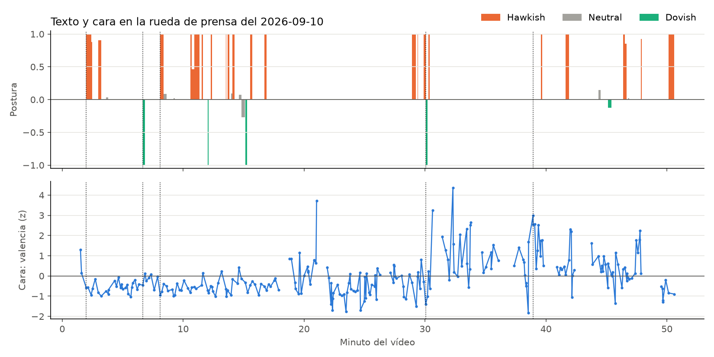
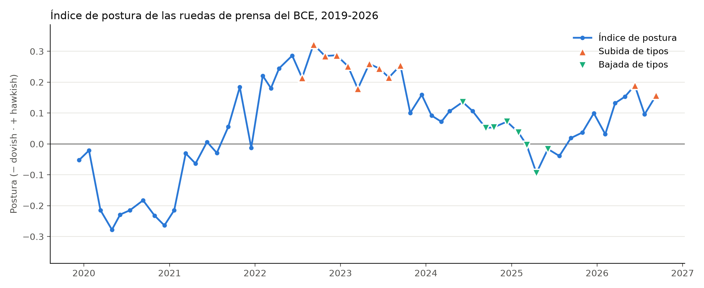
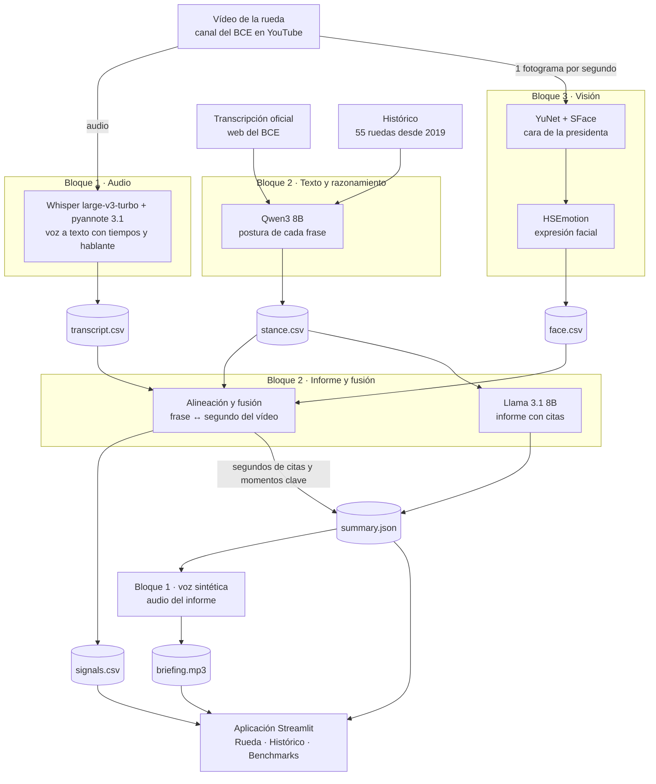
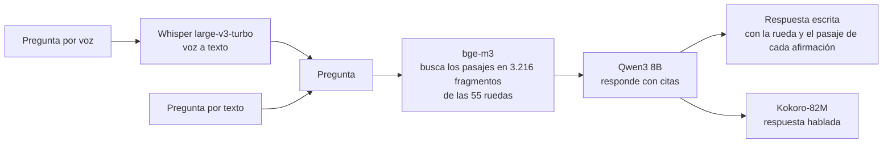

# Hawk & Dove · El tono del BCE, medido

Herramienta B2B para tesorerías, ALM y gestoras de renta fija que analiza las ruedas de prensa del Banco Central Europeo combinando texto, audio e imagen: **qué dice** la presidenta, **en qué segundo del vídeo** lo dice y **con qué expresión**, frase a frase y frente a todas las ruedas desde diciembre de 2019.

MVP del Taller B5-T4 del Máster MIAX · [Pitch técnico (PDF)](docs/hawk_and_dove_pitch.pdf) · Rueda de referencia: 10 de septiembre de 2026


## Contenido

1. [Qué hace](#qué-hace)
2. [Un ejemplo: la rueda del 10 de septiembre de 2026](#un-ejemplo-la-rueda-del-10-de-septiembre-de-2026)
3. [Capturas](#capturas)
4. [Arquitectura y flujo de datos](#arquitectura-y-flujo-de-datos)
5. [Modelos y evidencia](#modelos-y-evidencia)
6. [Puesta en marcha](#puesta-en-marcha)
7. [Uso de la aplicación](#uso-de-la-aplicación)
8. [Procesar una rueda nueva](#procesar-una-rueda-nueva)
9. [Viabilidad técnica y económica](#viabilidad-técnica-y-económica)
10. [Estructura del repositorio](#estructura-del-repositorio)
11. [Equipo](#equipo)

## Qué hace

El BCE da ocho ruedas de prensa al año, una tras cada reunión de política monetaria. Hoy se siguen en directo o a través de titulares: sin una medida del tono, sin comparación con las ruedas anteriores y sin la fuente de cada afirmación a mano. Hawk & Dove responde a las cuatro preguntas que se hace una mesa tras cada rueda:

| Pregunta | Respuesta de la aplicación | Modalidades |
|---|---|---|
| ¿Más hawkish o dovish que de costumbre? | **Índice de postura.** Cada frase de la presidenta y del vicepresidente se puntúa de −1 (dovish) a +1 (hawkish), y la rueda se sitúa en percentil frente a las 55 ruedas desde diciembre de 2019, en total y por separado para la declaración y las respuestas. | Texto → texto |
| ¿Qué ha dicho? | **Informe breve en inglés.** El tono frente al histórico y cinco frases, cada una con su cita a la transcripción oficial. También en audio, con voz sintética. | Texto → texto, texto → voz |
| ¿Cómo lo ha dicho? | **Línea temporal frase a frase** con la postura y la expresión facial de la presidenta. Cada cita y cada momento clave salta a su segundo del vídeo. | Audio y vídeo → señales por frase |
| ¿Qué dijo antes sobre esto? | **Chat sobre las 55 ruedas**, en español o en inglés, por texto o por voz, con la rueda y el pasaje de cada afirmación. | Voz → texto → texto → voz |

Cada afirmación lleva su fuente, y el producto describe el tono de la comunicación: no predice la decisión de tipos ni recomienda posiciones.

## Un ejemplo: la rueda del 10 de septiembre de 2026

- **Decisión:** subida de 25 puntos básicos.
- **Tono:** *slightly hawkish* (+0,16), percentil 69 frente a las 55 ruedas, desde el 56 de julio. La declaración queda en el percentil 69, y las respuestas, en el 64.
- **Vídeo:** las 253 frases de la presidenta tienen su segundo en el vídeo, y el 97 % tiene expresión facial medida.
- **Momentos clave**, cada uno con su segundo del vídeo:
  - 01:59 · la subida de tipos (hawkish).
  - 06:40 · el consumo, apoyado por la caída de los precios de la energía (dovish).
  - 08:06 · la inflación de agosto, del 3,3 % (hawkish).
  - 30:03 · la inflación, más baja de lo previsto (dovish).
  - 38:56 · cambio de expresión de la presidenta, +2,5 desviaciones típicas sobre su media en la rueda, en una respuesta sobre la cancelación de deuda que el texto puntúa como neutral.
- **Informe:** el tono frente al histórico y cinco frases con sus citas a la declaración. Cada cita salta a su segundo del vídeo (la primera, al 02:30), y el informe se puede escuchar en audio (1:17).



El índice histórico sitúa cada rueda en su contexto: el mínimo de la pandemia en abril de 2020, el giro hawkish de febrero de 2022, el máximo en la subida de 75 pb de septiembre de 2022 y la subida del tono en 2026 con el choque energético.



## Capturas

La pestaña principal, Press conference, es la imagen del principio: vídeo, línea temporal, informe con audio y chat por texto o voz, y cada cita salta a su segundo. Las otras dos pestañas:

| Histórico | Benchmarks |
|---|---|
|  |  |
| Índice de postura de las 55 ruedas: global, declaración y respuestas. | Resultados de cada comparación de modelos, para auditar cada elección. |

## Arquitectura y flujo de datos

### Flujo de datos multimodal

Cada rueda se procesa una vez, tras publicarse la transcripción oficial. Tres bloques, cada uno con sus modelos, escriben sus ficheros en `data/events/<fecha>/` (cilindros), y la aplicación solo los lee.



La pieza que une las modalidades es la **alineación** (`src/text/alignment.py`). La transcripción oficial no tiene tiempos, y la del audio sí, pero con errores de reconocimiento. Las dos se emparejan palabra a palabra con `difflib.SequenceMatcher`, usando como anclas los tramos de al menos tres palabras seguidas iguales, y cada frase oficial toma el tiempo de su primera y de su última palabra. Con esos tiempos, la fusión (`src/text/fusion.py`) calcula la expresión media de la presidenta en la ventana de cada frase, ponderada por los segundos de solapamiento y solo con los fotogramas en que ella está en primer plano. También la expresa como desviación respecto a su media en la rueda, porque en una banquera central lo informativo es el cambio, no el nivel.

### Chat en vivo

Una pregunta por voz encadena cuatro modelos:



### Tres capas

| Capa | Dónde | Qué hace |
|---|---|---|
| Conexión con los modelos | `src/text/models/`, `src/audio/models/`, `src/vision/models/` | Un backend por modelo con la misma interfaz. El modelo de cada etapa se elige en `config.yaml` (texto y audio) o con `--backend` (cara), sin tocar la lógica. |
| Lógica | `src/text/`, `src/audio/`, `src/vision/`, `scripts/` | Postura, índice histórico, informe con citas, chat, alineación y fusión; transcripción, hablantes y voz sintética; fotogramas, detección e identificación de la cara y expresión facial. |
| Interfaz | `src/app/` | Streamlit. Solo lee `data/` y llama a las funciones del chat en vivo (`src/app/live.py`); no ejecuta el procesado de las ruedas. |

### Contrato de ficheros

Cada bloque escribe sus resultados en `data/events/<fecha>/`, y todo resultado con tiempo lleva `start` y `end` en segundos desde el inicio del vídeo.

| Fichero | Lo escribe | Contenido | Lo usa |
|---|---|---|---|
| `transcript.csv` | Bloque 1 · Whisper + pyannote | Segmentos del audio con inicio, fin, hablante y texto | Alineación |
| `face.csv` | Bloque 3 · YuNet + SFace + HSEmotion | Un fotograma por segundo: tipo de plano, quién aparece, probabilidad de ocho emociones, valencia y activación | Fusión y línea temporal |
| `stance.csv` | Bloque 2 · Qwen3 8B | Cada frase del panel con su segundo en el vídeo, su postura (−1 a +1), su etiqueta y sus probabilidades | Aplicación |
| `signals.csv` | Bloque 2 · alineación y fusión | Cada frase con su segundo, su postura y la expresión facial media de la presidenta, en nivel y en desviaciones típicas | Línea temporal y transcripción |
| `summary.json` | Bloque 2 · Llama 3.1 8B y fusión | Postura y percentiles de la rueda, informe con citas, momentos clave con su segundo y expresión facial media | Cabecera, informe y audio |
| `briefing.mp3` | Bloque 1 · voz sintética | El informe, leído | Informe |
| `projections.csv` | Bloque 3 | Proyecciones macroeconómicas del staff, tomadas de la declaración de política monetaria | Aplicación |

El histórico está en `data/history/`: las transcripciones oficiales de las 55 ruedas (`transcripts.parquet`, 15.065 frases), la postura de las 12.333 frases del panel (`stance_sentences.parquet`), el índice por rueda (`stance_by_conference.csv`) y el índice del chat (`rag_index/`).

## Modelos y evidencia

Las comparaciones de modelos y las validaciones están en los notebooks de `benchmarks/`, cada una con su decisión argumentada.

| Modalidad | Tarea | Modelo elegido | Alternativas comparadas | Resultado | Dónde verlo |
|---|---|---|---|---|---|
| Texto | Postura de cada frase | Qwen3 8B (MLX, 4 bits) | DeBERTa-v3 zero-shot, Llama 3.1 8B, BGE + regresión logística | F1 macro 0,67 (IC 95 %: 0,52–0,80) en 100 frases reales etiquetadas a ciegas, el mejor de los cuatro | [b2_02_postura](benchmarks/b2_02_postura.ipynb) |
| Texto | Índice histórico | Qwen3 8B | — | 55 ruedas y 12.333 frases, puntuadas una sola vez (≈ 85 min) | [b2_03_historico](benchmarks/b2_03_historico.ipynb) |
| Texto | Informe con citas | Llama 3.1 8B (MLX, 4 bits) | Qwen3 8B | Ninguna cifra sin respaldo en la transcripción en los 6 informes de 2026; las 30 frases citan su fuente y ninguna recomienda posiciones | [b2_06_informe](benchmarks/b2_06_informe.ipynb) |
| Texto | Búsqueda del chat | bge-m3 | BM25, MiniLM, bge-small, bge-large | El 75 % de los pasajes recuperados coincide al preguntar en español o en inglés (48 % con bge-large) | [b2_04_chat](benchmarks/b2_04_chat.ipynb) |
| Texto | Respuesta del chat | Qwen3 8B | — | 9–12 s por respuesta, con el modelo ya cargado para la postura | [b2_04_chat](benchmarks/b2_04_chat.ipynb) |
| Audio | Voz a texto con tiempos | Whisper large-v3-turbo | — | En las seis ruedas de 2026, entre el 99 % y el 100 % de las frases oficiales se empareja con el audio (cobertura media de 0,96 a 0,98) | [b2_05_fusion](benchmarks/b2_05_fusion.ipynb), `src/audio/transcription.py` |
| Audio | Quién habla | pyannote 3.1 | — | Hablante de cada segmento de `transcript.csv` | `src/audio/diarization.py` |
| Audio | Audio del informe | Voz neural en-GB-SoniaNeural de Microsoft (edge-tts) | — | Seis informes en audio, de 1:14 a 1:28 | [briefing.mp3](data/events/2026-09-10/briefing.mp3) de la rueda de referencia |
| Audio | Voz del chat | Kokoro-82M | — | 82 M parámetros: responde en local | `src/audio/tts.py` |
| Texto + audio + vídeo | Situar cada frase en el vídeo | Alineación propia (difflib) | Anclas de 1 palabra; sin corregir los fines de segmento | Error mediano de 0,29 s (p95: 1,29 s) con un 15 % de palabras mal reconocidas. Con el vídeo real, el 96 % de los primeros planos es de los periodistas en las preguntas, frente al 0 % en la declaración | [b2_05_fusion](benchmarks/b2_05_fusion.ipynb) |
| Vídeo | Cara y expresión facial | HSEmotion, con YuNet y SFace | SigLIP zero-shot, py-feat | Misma tendencia de valencia que SigLIP (ρ = 0,76) a 10 ms por cara, frente a 86 y 220 ms; SigLIP da «desprecio» en el 92 % de los segundos | [b3_01_expresion_facial](benchmarks/b3_01_expresion_facial.ipynb), [proceso](docs/b3_proceso_expresion_facial.ipynb) |

Otros notebooks: [b2_01_corpus](benchmarks/b2_01_corpus.ipynb) construye el corpus de las 55 ruedas a partir de la web del BCE, y [00_plantilla_benchmark](benchmarks/00_plantilla_benchmark.ipynb) es la plantilla común de los benchmarks. Las tablas y figuras de resultados están en `benchmarks/results/`, y la pestaña Benchmarks de la aplicación las muestra todas.

## Puesta en marcha

Requisitos: Python 3.11 y git. Clonad el repositorio fuera de carpetas sincronizadas (iCloud, OneDrive, Dropbox).

**Mac / Linux**

```bash
git clone https://github.com/eglezarr/hawk-and-dove_BCE.git
cd hawk-and-dove_BCE
python3.11 -m venv .venv
source .venv/bin/activate
pip install -e .
pip install -r requirements.txt
python scripts/download_videos.py
./run.sh
```

**Windows**

```bat
git clone https://github.com/eglezarr/hawk-and-dove_BCE.git
cd hawk-and-dove_BCE
py -3.11 -m venv .venv
.venv\Scripts\activate
pip install -e .
pip install -r requirements.txt
python scripts\download_videos.py
run.bat
```

- `scripts/download_videos.py` descarga el vídeo de la rueda de referencia en `data/raw/`, fuera de git; con `--all`, los de las seis ruedas de 2026. Los resultados de las ruedas ya procesadas están en el repositorio, así que la aplicación arranca sin ejecutar ningún modelo.
- La primera pregunta al chat descarga de Hugging Face bge-m3 y Qwen3 8B; la primera pregunta por voz, Whisper y Kokoro.
- El chat redacta la respuesta con MLX en los Mac con Apple Silicon. En otros equipos devuelve los pasajes más relevantes, con su rueda y su enlace.
- Para ejecutar los notebooks: `pip install -r requirements-bench.txt` y, en VS Code, el intérprete `.venv`.
- Para procesar ruedas nuevas: `cp .env.example .env` (`copy` en Windows) y añadid un token de Hugging Face en `HF_TOKEN`, que necesita la diarización. `.env` no se sube a git.

## Uso de la aplicación

La interfaz está en inglés, como las salidas del producto. En la barra lateral se elige la rueda, por defecto la más reciente. Las seis ruedas de 2026 tienen su informe con citas y en audio, y cada frase situada en su segundo del vídeo; la del 10 de septiembre incluye además la expresión facial de la presidenta.

- **Press conference.**
  - **Cabecera:** decisión de tipos, postura y percentil frente al histórico.
  - **Vídeo y línea temporal.**
  - **Transcripción con la postura de cada frase:** al seleccionar una fila, el vídeo salta a esa frase.
  - **Informe:** con su audio, sus fuentes y los momentos clave; cada ▶ lleva a su segundo.
  - **Proyecciones del staff.**
  - **Chat:** por texto o por micrófono.
- **History.** Evolución del índice de postura de las 55 ruedas, en total, en la declaración y en las respuestas, con la tabla de cada rueda.
- **Benchmarks.** Las tablas y figuras de `benchmarks/results/`, agrupadas por etapa.

## Procesar una rueda nueva

Cada paso escribe en `data/events/<fecha>/` y el siguiente lee de ahí. La primera vez, cada modelo se descarga de Hugging Face.

| Paso | Bloque | Cómo | Escribe |
|---|---|---|---|
| 1. Vídeo | — | Añadir la URL a `scripts/videos.yaml` y ejecutar `python scripts/download_videos.py AAAA-MM-DD` | `data/raw/AAAA-MM-DD.mp4` |
| 2. Transcripción oficial, postura e informe | 2 | `b2_01_corpus` (corpus), `python scripts/postura_historico.py` (postura de las frases nuevas), `b2_03_historico` (índice y percentiles), `b2_04_chat` (índice del chat) y `b2_06_informe` (informe con citas) | `stance.csv`, `summary.json` |
| 3. Audio | 1 | `procesar_evento("AAAA-MM-DD", "data/raw/AAAA-MM-DD.mp4")` de `src/audio/pipeline.py` (requiere ffmpeg y el token de `.env`) | `transcript.csv` |
| 4. Cara | 3 | `python -m src.vision.face AAAA-MM-DD` | `face.csv` |
| 5. Alineación y fusión | 2 | `python scripts/fusion_eventos.py --sin-voz AAAA-MM-DD` | tiempos en `stance.csv` y `summary.json`, `signals.csv` |
| 6. Audio del informe | 1 | `generar_briefing("AAAA-MM-DD")` de `src/audio/tts.py` | `briefing.mp3` |

`scripts/fusion_eventos.py` se puede repetir sin duplicar nada, y `b2_05_fusion` documenta y valida la alineación.

## Viabilidad técnica y económica

### Latencias

| Tarea | Tiempo | Cuándo |
|---|---|---|
| Responder una pregunta del chat | 9–12 s | En vivo |
| Buscar los pasajes (bge-m3) | 0,07 s | En vivo |
| Puntuar la postura de una rueda | ≈ 1,5 min | Tras la rueda |
| Redactar el informe | ≈ 1 min | Tras la rueda |
| Analizar la cara de una rueda | ≈ 2,5 min | Tras la rueda |
| Situar las frases en el vídeo y combinar señales | ≈ 1 s | Tras la rueda |
| Puntuar el histórico (12.333 frases) | ≈ 85 min | Una sola vez |

Tiempos medidos en local: los de texto, en un Mac con Apple Silicon; los de la cara, en un portátil sin GPU.

### Memoria

Qwen3 8B ocupa 5,1 GB; Llama 3.1 8B, 4,9 GB, y bge-m3, 2,3 GB. A la aplicación le bastan Qwen3 y bge-m3 (7,3 GB): Llama solo redacta el informe de cada rueda nueva. La cara se analiza en CPU, y HSEmotion ocupa unos 50 MB.

### Coste y monetización

Los modelos son abiertos y corren en local, así que una consulta no tiene coste por llamada. El único servicio en línea es la voz neural del audio del informe, que se genera una vez por rueda.

| Plan | Para quién | Precio | Incluye |
|---|---|---|---|
| Analyst | Un analista de tesorería o de renta fija | 129 € al mes por usuario | Informe de cada rueda con citas, índice de postura frente al histórico y chat sobre las 55 ruedas |
| Desk | Mesas de tesorería, ALM y renta fija de bancos, gestoras y empresas | 99 € por licencia y mes, desde 5 licencias | Todo lo de Analyst para cada usuario, un 23 % más barato por usuario |
| API de datos | Bancos y gestoras que integran el tono del BCE en sus propios modelos | Desde 1.500 € al mes | Índice de postura por rueda y por frase; señales e informes en JSON |

### Regulación y privacidad

Análisis preliminar, a validar con asesoría legal.

- **Información, no asesoramiento (MiFID II).** El producto describe el tono del BCE. Cada informe lleva un aviso legal y pasa un control automático de lenguaje de recomendación.
- **Trazabilidad.** Cada frase del informe cita la transcripción oficial y queda registrado qué modelo la escribió (`generated_with` en `summary.json`).
- **Datos.** El contenido del BCE es de uso libre citando la fuente; en un producto de pago hay que avisar de que el original es gratuito. Las preguntas del cliente no salen a APIs de terceros. La imagen y la voz de la presidenta son datos personales (RGPD).
- **AI Act.** Leer la expresión facial es reconocimiento de emociones: obligaciones de transparencia desde el 2/8/2026 y requisitos de alto riesgo desde el 2/12/2027, con los plazos del Digital Omnibus.

## Estructura del repositorio

```
hawk-and-dove_BCE/
├── src/
│   ├── audio/          Bloque 1: transcripción con tiempos, hablantes y voz sintética
│   ├── text/           Bloque 2: postura, índice histórico, informe, chat, alineación y fusión
│   ├── vision/         Bloque 3: fotogramas, cara de la presidenta y expresión facial
│   ├── app/            Aplicación Streamlit (solo lee data/)
│   └── config.py       Rutas comunes y carga de config.yaml
├── benchmarks/         Un notebook por etapa y sus resultados (results/)
├── scripts/            Descargas y procesado por lotes
├── data/
│   ├── events/<fecha>/ Resultados de cada rueda procesada
│   └── history/        Transcripciones oficiales, postura e índice del histórico
├── docs/               Pitch técnico, capturas y proceso de la expresión facial
├── config.yaml         Rueda de referencia y modelo elegido por etapa
├── requirements.txt    Dependencias de la aplicación
├── requirements-bench.txt  Dependencias de los notebooks
└── run.sh / run.bat    Arranque directo de la aplicación
```

Dentro de cada bloque, `models/` contiene la conexión con los modelos (un backend por candidato) y el resto de módulos, la lógica.

## Equipo

| Bloque | Responsable | Qué incluye |
|---|---|---|
| B1 · Audio | Eneko Amezcua | Transcripción con tiempos, hablantes y voz sintética |
| B2 · Texto y razonamiento | Eduardo González | Postura, índice histórico, informe con citas, chat, alineación y fusión |
| B3 · Visión y producto | Luis Coello | Expresión facial y aplicación |

## Referencias

- Altavilla, Brugnolini, Gürkaynak, Motto y Ragusa (2019), «Measuring euro area monetary policy», *Journal of Monetary Economics*.
- Curti y Kazinnik (2023), «Let's face it: Quantifying the impact of nonverbal communication in FOMC press conferences», *Journal of Monetary Economics*.
- Shah et al. (2025), conjunto de frases del BCE etiquetadas por postura (`gtfintechlab/european_central_bank`).
- Transcripciones oficiales: [ruedas de prensa del BCE](https://www.ecb.europa.eu/press/press_conference/html/index.en.html). Vídeos: canal oficial del BCE en YouTube.

*Hawk & Dove describe el tono de la comunicación del BCE con fines informativos; no es asesoramiento de inversión.*
